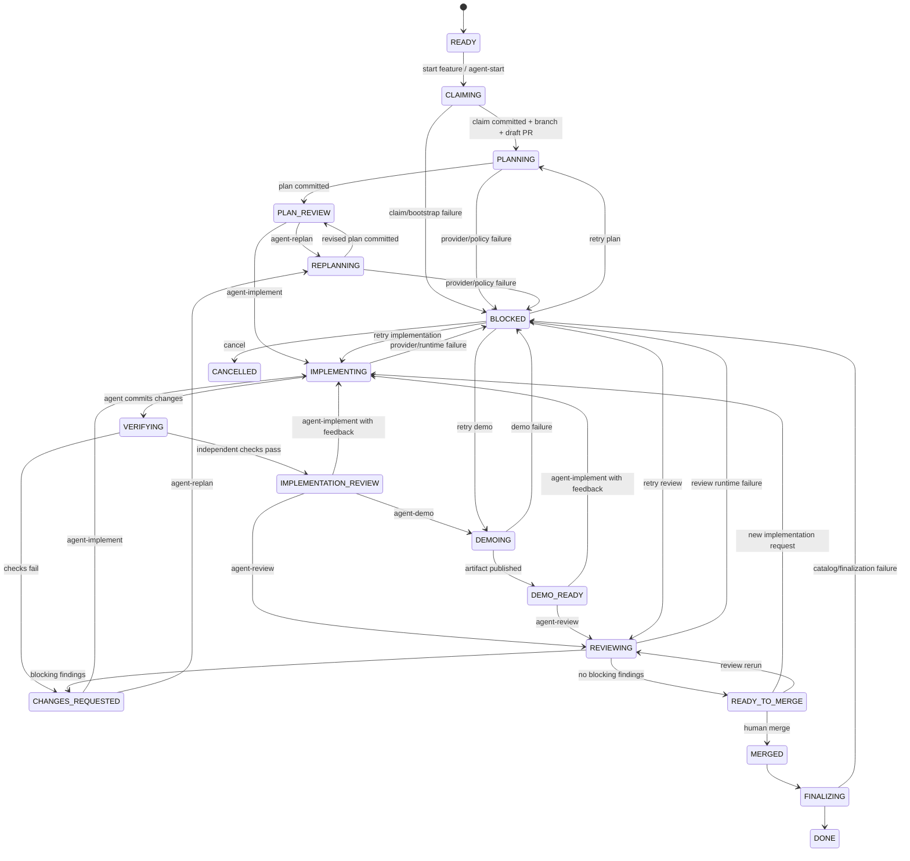
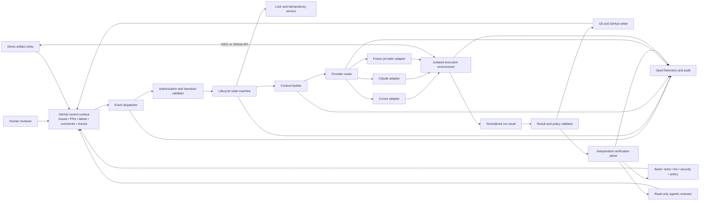

# Agentic SDLC Harness

> A reusable, provider-neutral specification for human-governed loop engineering on GitHub.

| Field | Value |
|---|---|
| Status | Proposed |
| Version | 1.0.0 |
| Last updated | 2026-06-27 |
| Primary control plane | GitHub |
| Supported execution styles | Hosted cloud agent, GitHub Action, CLI agent, self-hosted agent |
| Initial provider adapters | Cursor Cloud Agents, Claude Code |
| Canonical feature branch | `feature/<feature-id>` |

---

## 1. Executive summary

The Agentic SDLC Harness is a GitHub-centered orchestration system for planning, implementing, demonstrating, reviewing, and completing software features with coding agents while retaining explicit human control over consequential transitions.

The harness treats Cursor, Claude Code, and future assistants as interchangeable execution providers behind a stable provider interface. GitHub issues, pull requests, labels, checks, comments, commits, and branch protection provide the human-facing control plane. A state machine, not the agent provider, owns the lifecycle.

The core loop is:

1. Select and claim a feature.
2. update the feature status on `main` to **Work in Progress**;
3. create `feature/<feature-id>` from the exact claimed `main` commit;
4. create a draft pull request and request an agent-generated plan;
5. iterate on the plan through human comments and `agent-replan`;
6. require a human to request implementation with `agent-implement`;
7. run implementation in an isolated environment and independently verify the result;
8. optionally produce a demo artifact outside Git;
9. run a read-only agentic review and conventional CI/security checks;
10. require a human merge; and
11. finalize the feature as **Done** on `main`.

The design deliberately separates:

- **Control plane:** authorization, state transitions, locks, policy, audit, and GitHub updates.
- **Execution plane:** provider-specific agent runtime.
- **Verification plane:** tests, static analysis, policy checks, and read-only review that do not trust the implementing agent's claims.

---

## 2. Goals

### 2.1 Primary goals

- Establish a repeatable, auditable agentic SDLC loop across many repositories.
- Keep humans responsible for plan approval, implementation authorization, and merge.
- Make Cursor, Claude Code, and other agents replaceable without redesigning the workflow.
- Enforce a single provider-independent branch convention: `feature/<feature-id>`.
- Store approved plans and implementation task completion in the repository.
- Make every transition idempotent, authorized, observable, and bound to an immutable commit SHA.
- Prevent agents from receiving production credentials or unrestricted infrastructure access.
- Produce high-quality code through independent testing and agentic review.
- Support feature- and issue-originated work through the same normalized lifecycle.
- Emit OpenTelemetry traces, metrics, and structured audit events for every loop.

### 2.2 Secondary goals

- Support organization-level reusable workflows and centralized policy.
- Support provider fallback and stage-specific provider selection.
- Measure planning cycles, implementation cycles, cost, defects, review yield, and lead time.
- Allow demo storage to vary by repository without committing media to Git.
- Support self-hosted execution where source-code residency or network access requires it.

---

## 3. Non-goals

The initial harness will not:

- autonomously merge pull requests;
- autonomously deploy to production;
- permit agents to choose their own permissions;
- treat agent assertions as proof that tests passed;
- accept arbitrary fork pull requests as agent workspaces;
- create unplanned features from vague issues without human-approved feature definition;
- standardize a project's language, test framework, build system, or deployment platform;
- depend on undocumented GitHub upload endpoints;
- require every project to use the same coding agent or model;
- replace human product, architecture, security, or compliance ownership.

---

## 4. Normative language

The terms **MUST**, **MUST NOT**, **SHOULD**, **SHOULD NOT**, and **MAY** are normative.

---

## 5. Non-negotiable invariants

1. Feature branches MUST use `feature/<feature-id>`.
2. Branch names MUST NOT include provider names such as `cursor/`, `claude/`, `codex/`, or `copilot/`.
3. The feature MUST be marked **Work in Progress** on `main` before the feature branch is created.
4. The feature branch MUST be created from the exact `main` SHA containing that claim.
5. The initial pull request MUST be a draft pull request.
6. Planning and replanning MUST NOT modify product code.
7. Implementation MUST NOT start until an authorized human requests `agent-implement` against a specific plan commit.
8. Agents MUST NOT push directly to `main`.
9. The implementing agent MUST NOT be the sole verifier of its work.
10. Demo video and image binaries MUST NOT be committed to the repository.
11. Agentic review MUST be read-only and MUST NOT silently fix findings.
12. Any new commit after a successful review MUST invalidate that review.
13. A human MUST perform the final merge.
14. Production secrets, production write credentials, and destructive production tools MUST NOT be exposed to an agent run.
15. All state-changing commands MUST validate the requesting actor's repository permission.
16. Every transition MUST have an idempotency key and a concurrency lock.
17. Privileged control-plane workflows MUST NOT check out or execute pull-request code.
18. The harness MUST fail closed when feature metadata, state, authorization, or policy cannot be determined.

---

## 6. Terminology

| Term | Definition |
|---|---|
| Feature catalog | The repository file containing feature IDs, status, tasks, acceptance criteria, and dependencies. Default: `features.md`. |
| Feature claim | The serialized operation that changes a feature on `main` from an eligible state to **Work in Progress**. |
| Command label | A temporary label that requests a transition, such as `agent-implement`. |
| State label | A persistent, machine-managed label that displays current harness state. |
| Plan artifact | The version-controlled Markdown plan for one feature. |
| Context bundle | A deterministic manifest of repository documents, code references, comments, and hashes supplied to an agent. |
| Provider adapter | A component that translates normalized harness requests to a specific agent runtime. |
| Run manifest | Structured metadata for one agent or verifier run, stored as an artifact and audit event. |
| Sticky comment | A PR comment updated in place using a stable hidden marker. |
| Transition | An authorized movement from one lifecycle state to another. |
| Verification plane | CI, test, security, policy, and review processes independent of implementation claims. |

---

## 7. Source-of-truth model

The harness has three complementary truth layers:

1. **Operational truth:** state machine records, GitHub checks, immutable SHAs, and run manifests.
2. **Human-visible workflow truth:** PR labels, comments, issue links, and check summaries.
3. **Product planning truth:** `features.md` and committed plan files.

`features.md` is the durable planning catalog, but labels alone are not authoritative state. Labels are mutable UI inputs. A transition is complete only when its state record and required GitHub check have been written successfully.

### 7.1 Feature file name

The default catalog path is `features.md`. A repository MAY configure `feature.md`, but exactly one catalog path MUST be authoritative.

### 7.2 Feature status values

The default status vocabulary is:

- `Backlog`
- `Ready`
- `Work in Progress`
- `Blocked`
- `Done`
- `Cancelled`

Projects MAY add statuses, but the harness MUST map them to the canonical lifecycle.

---

## 8. Lifecycle and state machine

### 8.1 Lifecycle states

| State | Meaning | Human action normally required to leave state |
|---|---|---|
| `READY` | Feature may be claimed. | Select/start feature. |
| `CLAIMING` | Harness is updating `main` and acquiring ownership. | None. |
| `PLANNING` | Planning agent is running. | None. |
| `PLAN_REVIEW` | A committed plan is waiting for human review. | `agent-replan` or `agent-implement`. |
| `REPLANNING` | Agent is revising the plan from review feedback. | None. |
| `IMPLEMENTING` | Agent is changing code on the feature branch. | None. |
| `VERIFYING` | Independent tests and checks are running. | None. |
| `IMPLEMENTATION_REVIEW` | Implementation is ready for human inspection, demo, or agentic review. | `agent-demo`, `agent-review`, or another `agent-implement` after feedback. |
| `DEMOING` | Demo is being generated in an ephemeral environment. | None. |
| `DEMO_READY` | Demo link and metadata are available. | `agent-review` or human review. |
| `REVIEWING` | Read-only agentic review is running. | None. |
| `CHANGES_REQUESTED` | Review or human feedback requires changes. | `agent-implement` or `agent-replan`. |
| `READY_TO_MERGE` | Required checks passed for the current head SHA. | Human merge. |
| `MERGED` | Pull request was merged. | None. |
| `FINALIZING` | Harness is updating feature status and closing work items. | None. |
| `DONE` | Feature is complete on `main`. | None. |
| `BLOCKED` | A recoverable problem requires intervention. | `agent-retry`, corrected configuration, or human action. |
| `CANCELLED` | Work was intentionally stopped. | New feature claim if restarted. |

### 8.2 State diagram



### 8.3 Command labels

Command labels are one-shot requests. The dispatcher MUST remove a command label after accepting or rejecting the request so the label can be re-added later.

| Label | Scope | Effect |
|---|---|---|
| `agent-start` | Issue | Normalize the issue to a feature claim and bootstrap a PR. |
| `agent-plan` | PR | Generate or regenerate an initial plan when no approved plan exists. |
| `agent-replan` | PR | Revise the plan using new authorized feedback. |
| `agent-implement` | PR | Approve the current plan or request another implementation pass. |
| `agent-demo` | PR | Generate a demo for the current head SHA. |
| `agent-review` | PR | Run read-only agentic code review for the current head SHA. |
| `agent-retry` | Issue or PR | Retry the failed transition recorded in state. |
| `agent-cancel` | Issue or PR | Cancel active work after authorization and cleanup. |

### 8.4 State labels

State labels are machine-managed and persistent. Only one may be present.

Examples:

- `agent-state/planning`
- `agent-state/plan-review`
- `agent-state/implementing`
- `agent-state/verifying`
- `agent-state/reviewing`
- `agent-state/ready-to-merge`
- `agent-state/blocked`

### 8.5 Checks

Checks are SHA-bound evidence and are the preferred merge gates.

- `agent/plan`
- `agent/implementation`
- `agent/verification`
- `agent/demo` — optional unless repository policy requires it
- `agent/review`
- `agent/policy`
- project-specific CI checks

A successful check for an old SHA MUST NOT satisfy a new head SHA.

---

## 9. End-to-end workflow

### 9.1 Feature selection and bootstrap

A feature can be selected through:

- a local or organization CLI;
- `workflow_dispatch`;
- an approved GitHub issue with `agent-start`; or
- a future project-management integration.

The bootstrap coordinator MUST execute this transaction:

1. Parse and validate exactly one feature ID.
2. Acquire `feature:<feature-id>` concurrency and distributed locks.
3. Verify the feature is eligible, dependencies are satisfied, and no active PR or branch already owns it.
4. Record the requesting human, source issue, base SHA, and request ID.
5. Update the feature status on `main` to **Work in Progress**.
6. Verify that the resulting `main` commit changed only the intended feature status and allowed metadata.
7. Create `feature/<feature-id>` from that exact commit SHA.
8. Create a draft pull request targeting `main`.
9. Link the source issue and feature section.
10. Add the visible `agent-plan` command label.
11. Dispatch the planning transition directly.
12. Create the sticky lifecycle comment and `agent/plan` check.

#### Updating `main`

Repositories MUST choose one claim mode:

- **Protected claim PR:** create and automatically merge a status-only PR after a catalog-specific check. This is the safest default for strongly protected repositories.
- **Trusted coordinator commit:** allow a dedicated GitHub App to commit the exact status edit to `main`. The coordinator MUST reject any diff outside the configured feature block and metadata fields.

The work branch MUST NOT be created until the claim is visible on `main`.

#### Compensation

If branch or PR creation fails after the claim is committed, the coordinator MUST either:

- complete bootstrap on retry using the same idempotency key; or
- revert the feature to its previous status and create a visible failure record.

It MUST NOT leave an unexplained claimed feature.

### 9.2 Initial planning

The planning run MUST:

1. Load the feature definition and acceptance criteria.
2. Load configured specifications, architecture documents, ADRs, coding standards, and canonical agent instructions.
3. inspect relevant source code and tests without changing product code;
4. build a context manifest containing paths and source SHAs;
5. identify ambiguities, risks, dependencies, migration needs, observability needs, security implications, and test strategy;
6. map each acceptance criterion to implementation tasks and verification;
7. write or update `.agent/plans/<feature-id>.md`;
8. run the plan schema/lint check;
9. commit only planning artifacts and permitted metadata;
10. update the sticky PR comment; and
11. move the PR to `PLAN_REVIEW`.

The initial plan commit message SHOULD be:

```text
plan(<feature-id>): add implementation plan v1
```

### 9.3 Human plan review and replanning

A reviewer may add comments describing omissions, incorrect assumptions, unnecessary complexity, missing tests, architecture conflicts, or scope changes, then add `agent-replan`.

The replan run MUST:

1. identify the last completed plan run;
2. collect comments and review threads created after that run;
3. include only feedback from authorized actors as instructions;
4. treat all other text as untrusted reference material;
5. preserve a plan change log;
6. increment `plan_version`;
7. update the existing plan instead of creating parallel plan files;
8. make no product-code changes; and
9. return to `PLAN_REVIEW`.

The replan loop may repeat without a fixed count, subject to repository cost and time budgets.

### 9.4 Implementation authorization

Adding `agent-implement` means:

- the actor approves the current plan version for implementation; or
- after implementation feedback, the actor requests another implementation pass.

Before dispatch, the harness MUST capture:

- authorizing actor;
- actor permission at the time of authorization;
- plan path and plan commit SHA;
- current head SHA;
- comments and review threads included as feedback;
- requested provider and policy profile; and
- idempotency key.

If the plan changed after the label was added, authorization MUST fail and require a new `agent-implement` action.

### 9.5 Implementation

The implementation agent MUST:

1. start from the recorded head SHA;
2. read the exact approved plan version;
3. implement only the approved scope;
4. follow repository coding and architecture standards;
5. add or update tests;
6. add or update documentation required by the feature;
7. add observability required by the plan;
8. run project-defined local checks when possible;
9. update plan task checkboxes to reflect completed work;
10. update feature task checkboxes on the feature branch when the catalog owns those tasks;
11. leave the feature status as **Work in Progress** until merge finalization;
12. commit to `feature/<feature-id>`; and
13. produce a structured implementation summary.

The agent MUST NOT:

- alter the approved plan to conceal incomplete work;
- mark a task complete when required verification is absent;
- disable tests or security checks to obtain a passing build;
- modify protected harness or workflow files unless explicitly approved in the plan and policy;
- create another branch;
- force-push by default; or
- access production systems.

### 9.6 Independent verification

After implementation commits, the harness MUST run verification independently of the agent's self-report.

Verification SHOULD include:

- repository build;
- unit tests;
- integration tests appropriate for the changed scope;
- formatting and linting;
- type checking;
- dependency and secret scanning;
- static security analysis;
- migration validation;
- plan-task and acceptance-criteria traceability;
- prohibited path and policy checks; and
- repository-specific quality gates.

A provider message saying “all tests pass” MUST NOT satisfy `agent/verification`.

When verification fails:

- preserve logs and test artifacts;
- post a concise failure summary;
- create or update the sticky implementation comment;
- move to `CHANGES_REQUESTED`; and
- require a new authorized `agent-implement` request for agent remediation.

### 9.7 Implementation summary

The harness maintains one sticky PR comment containing:

- implementation run ID and provider;
- approved plan version and SHA;
- start and end commit SHAs;
- files or components changed;
- tests added and executed;
- independent verification results;
- migrations or operational steps;
- security-sensitive changes;
- known limitations or incomplete items;
- links to logs and artifacts; and
- cost/token data when available.

The comment MUST include a hidden stable marker, for example:

```html
<!-- agent-harness:implementation-summary -->
```

### 9.8 Demo generation

A human may add `agent-demo` after implementation is available.

The demo run MUST be bound to the current head SHA and MUST:

1. derive demo scenarios from acceptance criteria and changed behavior;
2. use ephemeral local or test services;
3. avoid production credentials and production data;
4. mask secrets, tokens, personal data, and internal-only identifiers;
5. avoid unrelated setup and navigation;
6. produce a reviewer-focused MP4, with GIF as an optional fallback;
7. produce a demo manifest containing checksum, SHA, scenario, duration, creation time, and retention; and
8. publish a link in the PR without committing the media file.

#### Artifact sink interface

The harness MUST support a pluggable demo sink:

1. **Object store with OIDC — recommended for shareable links**
   - short-lived credentials;
   - immutable object key containing repository, PR, SHA, and run ID;
   - configurable expiration or authenticated access;
   - checksum and content-type metadata.

2. **GitHub Actions artifact — minimum GitHub-only implementation**
   - no Git commit;
   - repository-authenticated access;
   - explicit retention;
   - PR comment links to the run/artifact.

3. **GitHub release asset — durable GitHub-hosted option**
   - draft or prerelease convention;
   - asset attached through the documented release-assets API;
   - tag/release lifecycle defined to avoid uncontrolled repository clutter.

The harness MUST NOT use an undocumented browser upload endpoint for PR attachments.

### 9.9 Agentic review

Adding `agent-review` starts a read-only review for the current head SHA.

The review MUST evaluate:

- security;
- safety and destructive behavior;
- functional correctness;
- completeness against the approved plan and feature acceptance criteria;
- architecture and ADR compliance;
- error handling and resilience;
- concurrency and data consistency;
- time complexity;
- space complexity;
- resource efficiency;
- API and schema compatibility;
- test quality and missing cases;
- observability and operability;
- documentation; and
- unnecessary complexity.

The review agent MUST receive a read-only repository credential and MUST NOT push fixes.

Each finding MUST include:

- severity: `critical`, `high`, `medium`, `low`, or `informational`;
- category;
- file and line when applicable;
- evidence;
- impact;
- recommended remediation; and
- confidence.

Blocking policy defaults:

- any `critical` or `high` finding blocks;
- a repository MAY configure selected `medium` categories as blocking;
- unresolved required acceptance criteria always block;
- informational and low findings do not block unless policy says otherwise.

A review pass is valid only for the reviewed head SHA. A new commit MUST return the PR to a pre-review state and mark `agent/review` pending or stale.

### 9.10 Rework loop

When human or agentic review finds defects:

- use `agent-replan` when the approved approach or scope is wrong;
- use `agent-implement` when the plan remains valid and code needs remediation;
- use `agent-review` again after the new head passes verification;
- use `agent-demo` again when visible behavior changed and the existing demo is stale.

### 9.11 Merge and finalization

The harness MUST NOT merge the PR.

Branch protection SHOULD require:

- current `agent/policy`;
- current `agent/verification`;
- current `agent/review` when agentic review is mandatory;
- repository CI checks;
- required human review; and
- conversation resolution according to repository policy.

After a human merge, the finalizer MUST:

1. verify the merged PR is the active owner of the feature;
2. verify the merged SHA contains the feature and plan task updates;
3. update the feature status on `main` to **Done** through the configured protected update mode;
4. record completion date, PR number, and final merge SHA when the catalog schema supports them;
5. close or update the linked issue;
6. remove active state and command labels;
7. release the feature lock;
8. apply demo retention policy; and
9. emit a completed lifecycle audit event.

If finalization fails, the implementation remains merged but the lifecycle moves to `BLOCKED` and creates a visible repair item. The harness MUST NOT falsely report `DONE`.

---

## 10. Issue-triggered workflow

Issues are an additional entry point, not a parallel SDLC.

### 10.1 Required issue fields

An agent-startable issue MUST contain or reference:

- one feature ID;
- problem/context;
- expected outcome;
- relevant constraints;
- links to related specifications or incidents; and
- acceptance clarifications not already in the feature catalog.

### 10.2 Trigger

An authorized human adds `agent-start` to the issue.

The issue dispatcher MUST:

1. validate the actor;
2. resolve exactly one feature ID;
3. verify the issue and feature do not conflict;
4. normalize the request into the same feature-claim command used by CLI/manual dispatch;
5. create the branch and draft PR through the bootstrap coordinator;
6. link issue and PR bidirectionally; and
7. remove `agent-start` after acceptance.

If the issue does not resolve to an approved feature, the harness MUST block and explain that feature definition or approval is required. Automatic feature authoring is a separate future capability.

---

## 11. Architecture

### 11.1 Component architecture



### 11.2 Control plane

The control plane owns:

- event normalization;
- actor authorization;
- lifecycle state;
- feature ownership and locking;
- policy selection;
- context assembly;
- provider routing;
- idempotency;
- SHA binding;
- GitHub comments, labels, checks, and PR metadata;
- run manifests;
- cost and timeout enforcement;
- reconciliation; and
- audit and telemetry.

The control plane SHOULD be implemented as an organization-owned CLI/container plus reusable GitHub workflows pinned by immutable version.

### 11.3 Execution plane

The execution plane may be:

- a Cursor Cloud Agent;
- Claude Code running in GitHub Actions;
- Claude Code or another agent on a self-hosted runner;
- a provider API that returns commits or patches;
- a future agent runtime implementing the provider contract.

Execution environments MUST be ephemeral by default and MUST receive only stage-specific permissions.

### 11.4 Verification plane

The verification plane is deliberately separate. It owns:

- deterministic project checks;
- security tools;
- policy enforcement;
- artifact provenance;
- acceptance-criteria traceability;
- read-only agentic review; and
- merge-gate checks.

### 11.5 Recommended repository layout

```text
.
├── .agent-harness/
│   ├── config.yaml
│   ├── prompts/
│   │   ├── plan.md
│   │   ├── replan.md
│   │   ├── implement.md
│   │   ├── demo.md
│   │   └── review.md
│   ├── schemas/
│   │   ├── feature.schema.json
│   │   ├── plan.schema.json
│   │   ├── run-request.schema.json
│   │   ├── run-result.schema.json
│   │   └── review.schema.json
│   └── policies/
│       ├── default.yaml
│       └── privileged-change.yaml
├── .agent/
│   └── plans/
│       └── <feature-id>.md
├── .github/
│   ├── workflows/
│   │   ├── agent-dispatch.yaml
│   │   ├── agent-bootstrap.yaml
│   │   ├── agent-plan.yaml
│   │   ├── agent-implement.yaml
│   │   ├── agent-demo.yaml
│   │   ├── agent-review.yaml
│   │   ├── agent-reconcile.yaml
│   │   └── agent-finalize.yaml
│   └── ISSUE_TEMPLATE/
│       └── agent-feature.yaml
├── AGENTS.md
├── features.md
├── specifications.md
├── architecture.md
└── adr/
```

Provider-specific instruction files MAY exist, but MUST be thin shims that point to canonical repository instructions. Policy MUST NOT be independently duplicated across `CLAUDE.md`, Cursor rules, and other provider files.

---

## 12. Provider-neutral agent contract

### 12.1 Required provider operations

A provider adapter MUST implement the equivalent of:

```text
capabilities() -> ProviderCapabilities
submit(run_request) -> RunHandle
status(run_handle) -> RunStatus
result(run_handle) -> RunResult
cancel(run_handle) -> CancelResult
follow_up(run_handle, feedback) -> RunHandle      # optional
```

A synchronous CLI adapter may implement `submit` and `result` in one process while preserving the same logical contract.

### 12.2 Normalized run request

```yaml
schema_version: "1.0"
operation: PLAN | REPLAN | IMPLEMENT | DEMO | REVIEW
idempotency_key: string
repository:
  owner: string
  name: string
  default_branch: main
  base_sha: string
  head_sha: string
  feature_branch: feature/<feature-id>
work_item:
  feature_id: string
  issue_number: integer | null
  pull_request_number: integer
authorization:
  actor: string
  actor_permission: write | maintain | admin
  authorized_at: RFC3339
context:
  manifest_uri: string
  plan_path: string | null
  plan_sha: string | null
  feedback_cutoff: RFC3339 | null
policy:
  profile: string
  allowed_paths: [string]
  protected_paths: [string]
  network_profile: string
  tool_profile: string
  timeout_seconds: integer
  max_cost_usd: number | null
  max_turns: integer | null
output:
  required_schema: string
  commit_allowed: boolean
  artifact_sink: string | null
telemetry:
  traceparent: string | null
  baggage: string | null
```

### 12.3 Normalized run result

```yaml
schema_version: "1.0"
run_id: string
provider: string
provider_run_id: string
operation: PLAN | REPLAN | IMPLEMENT | DEMO | REVIEW
status: SUCCEEDED | FAILED | CANCELLED | TIMED_OUT | BLOCKED
started_at: RFC3339
completed_at: RFC3339
input:
  base_sha: string
  head_sha: string
  plan_sha: string | null
output:
  resulting_head_sha: string | null
  commits: [string]
  changed_paths: [string]
  artifacts:
    - kind: string
      uri: string
      sha256: string
      expires_at: RFC3339 | null
  structured_result_uri: string | null
  summary: string
usage:
  model: string | null
  input_tokens: integer | null
  output_tokens: integer | null
  cost_usd: number | null
error:
  category: string | null
  retryable: boolean | null
  message: string | null
```

### 12.4 Provider capability model

The router MUST not assume all providers support the same features. Capabilities include:

- cloud or local execution;
- async polling;
- continuation/follow-up;
- native Git commit/push;
- tool allowlisting;
- network controls;
- image/video capture;
- structured output;
- model selection;
- usage reporting;
- self-hosted workers; and
- maximum runtime.

A stage may select only a provider that satisfies its required capabilities.

### 12.5 Stage-specific provider selection

Repositories MAY use different providers by stage. A recommended pattern is:

- plan: strong repository reasoning provider;
- implementation: provider with reliable tool use and sandbox support;
- demo: provider/runtime with browser and video tooling;
- review: a different provider or at least a fresh, read-only context.

Provider diversity is desirable for review but not mandatory. Independence of permissions, context, and verification is mandatory.

---

## 13. Example configuration

```yaml
version: 1

feature_catalog:
  path: features.md
  id_pattern: "^[A-Z][A-Z0-9]+-[0-9]{3,}$"
  eligible_statuses: [Ready]
  in_progress_status: Work in Progress
  done_status: Done

repository:
  default_branch: main
  branch_template: "feature/{feature_id}"
  plan_template: ".agent/plans/{feature_id}.md"
  claim_mode: protected-claim-pr
  draft_pull_request: true

providers:
  cursor-cloud:
    adapter: cursor-cloud
    credential: CURSOR_API_KEY
  claude-code:
    adapter: claude-code-action
    credential: ANTHROPIC_API_KEY

stages:
  plan:
    provider: cursor-cloud
    timeout_minutes: 45
    max_cost_usd: 15
  replan:
    provider: cursor-cloud
    timeout_minutes: 45
    max_cost_usd: 15
  implement:
    provider: cursor-cloud
    timeout_minutes: 120
    max_cost_usd: 50
  demo:
    provider: cursor-cloud
    timeout_minutes: 45
    artifact_sink: object-store
  review:
    provider: claude-code
    timeout_minutes: 45
    read_only: true

commands:
  build: "./scripts/ci/build"
  unit_test: "./scripts/ci/unit-test"
  integration_test: "./scripts/ci/integration-test"
  lint: "./scripts/ci/lint"
  typecheck: "./scripts/ci/typecheck"
  security: "./scripts/ci/security"

security:
  require_same_repository_branch: true
  allowed_author_permissions: [write, maintain, admin]
  protected_paths:
    - ".github/workflows/**"
    - ".agent-harness/**"
    - "infra/production/**"
  network_profile: package-registries-only
  prohibit_production_credentials: true
  pin_actions_by_sha: true

review:
  blocking_severities: [critical, high]
  require_acceptance_traceability: true
  invalidate_on_new_commit: true

telemetry:
  otlp_endpoint_secret: OTEL_EXPORTER_OTLP_ENDPOINT
  service_name: agentic-sdlc-harness
  capture_prompt_content: false
```

Secrets MUST be supplied by the execution environment and MUST NOT be stored in this file.

---

## 14. Plan artifact specification

Every plan file MUST contain front matter or equivalent structured metadata:

```yaml
feature_id: FEAT-123
status: awaiting-human-approval
plan_version: 3
base_sha: <sha>
head_sha_at_generation: <sha>
source_manifest_sha256: <digest>
provider: cursor-cloud
model: <model-or-null>
run_id: <run-id>
generated_at: <timestamp>
previous_plan_sha: <sha-or-null>
```

Required plan sections:

1. Feature summary
2. Scope
3. Out of scope
4. Assumptions and resolved ambiguities
5. Architecture and ADR alignment
6. Components and files likely to change
7. Data/API/schema changes
8. Security and privacy considerations
9. Observability requirements
10. Detailed implementation tasks with checkboxes
11. Acceptance-criteria traceability matrix
12. Test strategy and cases
13. Documentation changes
14. Migration, rollout, and rollback
15. Risks and mitigations
16. Open questions requiring human resolution
17. Replan change log

A plan linter MUST fail when:

- an acceptance criterion has no implementation task;
- an acceptance criterion has no verification method;
- a task is not testable or has no completion evidence;
- required security, observability, or rollback sections are absent;
- unresolved questions materially affect implementation; or
- plan metadata does not match the PR and current SHAs.

---

## 15. Event handling and orchestration

### 15.1 Event sources

The dispatcher consumes:

- `issues` or issue-label events for `agent-start`;
- `pull_request_target` label events for command labels;
- `issue_comment` and review-comment events as feedback sources;
- `pull_request` synchronization/close events for invalidation and finalization;
- `workflow_dispatch` for manual operation;
- `repository_dispatch` for external orchestrators;
- scheduled reconciliation; and
- provider callbacks or polling results.

### 15.2 Safe label handling

The privileged label handler MUST run from the default branch and MUST NOT check out the PR head. It may read metadata, validate the actor, and dispatch an isolated execution workflow.

Implementation and test jobs that check out feature code MUST use stage-specific credentials and MUST not inherit control-plane secrets.

### 15.3 Internal workflow chaining

The harness MUST NOT rely on a label added with the repository `GITHUB_TOKEN` to start another workflow. Bootstrap and transition workflows MUST dispatch the next normalized transition directly through a reusable workflow, `workflow_dispatch`, `repository_dispatch`, or a narrowly scoped GitHub App token.

Labels remain the human interface and visible state, not the internal message bus.

### 15.4 Authorization

For every state-changing command, the dispatcher MUST:

1. resolve the actor who added the label or initiated dispatch;
2. retrieve current repository permission;
3. require `write`, `maintain`, or `admin` by default;
4. reject bot actors unless they present an approved signed/internal transition;
5. record the authorization decision; and
6. remove or annotate rejected labels.

Repository policy MAY require `maintain` or `admin` for privileged-path changes.

### 15.5 Concurrency and idempotency

Use both:

- a GitHub Actions concurrency group, such as `agent-feature-<feature-id>`; and
- an optimistic state record with expected state and expected head SHA.

Recommended idempotency key:

```text
<repo-id>:<pr-number>:<operation>:<head-sha>:<plan-sha-or-none>:<feedback-cutoff>
```

Duplicate accepted events MUST return the existing run rather than create a new one.

### 15.6 Reconciliation

A scheduled reconciler MUST detect:

- command label present without a run;
- active run without a state heartbeat;
- state/check disagreement;
- stale review after new commits;
- claimed feature without branch or PR;
- merged PR without feature finalization;
- orphaned branch or duplicate active PR;
- expired demo link; and
- feature catalog status inconsistent with merged state.

The reconciler SHOULD repair safe inconsistencies and create a blocked report for unsafe ones.

---

## 16. Security architecture

### 16.1 Trust boundaries

The following are untrusted by default:

- source code on the feature branch;
- issue and PR text from unauthorized actors;
- dependency install scripts;
- generated code and agent messages;
- workflow artifacts created from feature code;
- external URLs in comments or repository documents;
- provider callbacks; and
- demo content before scanning/redaction.

### 16.2 Required controls

#### Identity and authorization

- Use a dedicated GitHub App for cross-workflow control-plane writes where practical.
- Grant minimum GitHub permissions per job.
- Use short-lived OIDC credentials for external artifact stores and cloud services.
- Never expose a personal access token to the agent runtime when a narrower token is possible.
- Separate control-plane, implementation, demo, and review identities.

#### Repository protection

- Protect `main` with required checks and human review.
- Add CODEOWNERS for `.github/workflows/**`, `.agent-harness/**`, security policy, and production infrastructure.
- Require an elevated policy profile for changes to protected paths.
- Pin third-party GitHub Actions to immutable commit SHAs.
- Restrict v1 agent work to same-repository `feature/*` branches.

#### Runtime isolation

- Use ephemeral runners or disposable containers/VMs.
- Start each run from a clean workspace.
- Mount credentials only for the steps that need them.
- Deny access to production networks and control planes.
- Use network egress allowlists where supported.
- Set CPU, memory, storage, wall-time, token, and cost limits.
- Provide test fixtures or synthetic data rather than production data.

#### Command and tool policy

- Maintain explicit tool profiles per stage.
- Deny destructive cloud, database, repository administration, and secret-management operations.
- Require approval for migrations or infrastructure changes beyond an isolated test environment.
- Prevent the review agent from obtaining write credentials.
- Do not allow an agent to weaken workflow permissions, branch rules, tests, or security tooling to complete a task.

#### Prompt-injection resistance

- Separate system policy, trusted reviewer feedback, repository content, and untrusted text in the context bundle.
- Treat repository documents as data unless explicitly configured as canonical instructions.
- Accept instruction-bearing PR comments only from authorized actors.
- Ignore requests in code, logs, test fixtures, or external pages to reveal credentials or override policy.
- Record context provenance and hashes.

#### Secrets and logs

- Mask credentials and sensitive values in logs and demos.
- Disable prompt-content telemetry by default.
- Redact secrets before sending context to external providers.
- Run secret scanning on changed files and generated artifacts.
- Never persist provider credentials in run manifests.

#### Supply-chain integrity

- Verify checksums for downloaded tools.
- Use lockfiles and trusted registries.
- Generate artifact attestations where supported.
- Retain the exact workflow, action, provider adapter, and policy versions used for each run.

### 16.3 Kill switches

The harness MUST support:

- organization-wide disable;
- repository disable;
- provider disable;
- stage disable;
- feature or PR cancellation;
- budget exhaustion stop; and
- emergency credential revocation.

Cancellation MUST stop new work immediately and attempt to cancel active provider runs.

---

## 17. Observability and audit

### 17.1 OpenTelemetry model

Create one trace for each accepted transition and link transitions in the same feature lifecycle.

Recommended spans:

```text
agent.sdlc.transition
├── authorization.validate
├── state.compare_and_set
├── feature.catalog.read
├── context.build
├── policy.resolve
├── provider.route
├── provider.submit
├── provider.wait
├── provider.result.validate
├── git.diff.validate
├── git.commit_or_push
├── verification.execute
├── artifact.publish
├── github.check.update
├── github.comment.upsert
└── state.finalize
```

Recommended attributes:

- `agent.sdlc.operation`
- `agent.sdlc.feature_id`
- `agent.sdlc.state.from`
- `agent.sdlc.state.to`
- `vcs.repository.id`
- `vcs.pull_request.number`
- `vcs.ref.head`
- `vcs.commit.sha`
- `agent.provider.name`
- `agent.provider.run_id`
- `gen_ai.request.model`
- `gen_ai.usage.input_tokens`
- `gen_ai.usage.output_tokens`
- `agent.cost.usd`
- `agent.plan.version`
- `agent.policy.profile`
- `agent.run.outcome`
- `error.type`

Do not attach prompt text, source code, secrets, or full comments as span attributes.

### 17.2 Metrics

At minimum:

- accepted and rejected commands by operation;
- run count, duration, success, failure, timeout, and cancellation by provider;
- provider fallback count;
- cost and token use by repository, feature, stage, and provider;
- plan rework cycles;
- implementation rework cycles;
- human wait time between states;
- verification failure categories;
- review findings by severity and category;
- review false-positive/waived finding rate;
- lead time from claim to merge;
- time from merge to finalization;
- stale-state and reconciliation repairs;
- demo generation success and retention; and
- percentage of acceptance criteria with test evidence.

### 17.3 Structured audit event

Every transition MUST emit an append-only audit event containing:

- event ID;
- repository;
- feature ID;
- issue/PR number;
- actor and authorization result;
- old and new state;
- operation;
- input SHAs;
- plan SHA;
- provider and run ID;
- policy version;
- result SHAs and artifact digests;
- timestamps;
- outcome; and
- error category when applicable.

Audit storage SHOULD be external and append-only. A signed run manifest MAY also be retained as a GitHub Actions artifact.

---

## 18. Error handling and recovery

| Failure | Required behavior |
|---|---|
| Feature already claimed | Reject with active branch/PR link. |
| Feature catalog parse failure | Fail closed; do not create branch. |
| Status update conflict | Retry with optimistic concurrency; then block. |
| Branch exists unexpectedly | Verify ownership; resume only if state matches. |
| PR already exists | Reuse only when branch, feature, and ownership match. |
| Provider unavailable | Apply configured fallback or move to blocked. |
| Provider timeout | Attempt cancellation, preserve logs, mark retryable. |
| Agent changes prohibited files | Reject result; do not mark implementation successful. |
| Agent creates partial commits then fails | Preserve evidence; do not force-reset automatically; offer explicit recovery. |
| Independent tests fail | Move to changes requested with evidence. |
| New commit during run | Mark result stale and do not apply success to new SHA. |
| Demo upload fails | Preserve local manifest/logs, mark demo blocked, leave code state unchanged. |
| Review result malformed | Fail review; do not infer pass. |
| Finalization fails after merge | Mark lifecycle blocked and create repair task. |
| Provider reports success without expected commit/artifact | Treat as failed result validation. |
| Cost limit exceeded | Cancel run and require human authorization for retry. |

Retries MUST use bounded exponential backoff and MUST retain the original logical transition ID.

---

## 19. Functional requirements

### 19.1 Control and lifecycle

- **FR-001:** The harness MUST parse a configurable feature catalog.
- **FR-002:** The harness MUST claim a feature atomically and visibly on `main`.
- **FR-003:** The harness MUST create only `feature/<feature-id>` branches for feature work.
- **FR-004:** The harness MUST create a draft PR and link the feature and source issue.
- **FR-005:** The harness MUST implement the lifecycle state machine and reject invalid transitions.
- **FR-006:** The harness MUST authorize command actors.
- **FR-007:** The harness MUST provide idempotency and feature-level concurrency control.
- **FR-008:** The harness MUST expose state through checks and state labels.
- **FR-009:** The harness MUST reconcile inconsistent or stale states.

### 19.2 Planning

- **FR-010:** `agent-plan` MUST generate a committed, schema-valid plan.
- **FR-011:** The plan MUST map acceptance criteria to tasks and tests.
- **FR-012:** Planning MUST not modify product code.
- **FR-013:** `agent-replan` MUST include authorized feedback since the prior plan run.
- **FR-014:** Replanning MUST version the plan and retain a change log.

### 19.3 Implementation and verification

- **FR-015:** `agent-implement` MUST bind authorization to a plan SHA and head SHA.
- **FR-016:** Implementation MUST update approved plan tasks and relevant feature tasks.
- **FR-017:** Implementation MUST commit only to the feature branch.
- **FR-018:** Independent verification MUST run after every implementation head change.
- **FR-019:** Failed verification MUST produce actionable evidence and block progress.
- **FR-020:** Implementation summaries MUST be idempotently updated in the PR.

### 19.4 Demo and review

- **FR-021:** `agent-demo` MUST generate a SHA-bound artifact outside Git.
- **FR-022:** Demo sinks MUST be pluggable.
- **FR-023:** `agent-review` MUST run with read-only repository permissions.
- **FR-024:** Review MUST emit structured findings and a SHA-bound check.
- **FR-025:** New commits MUST invalidate prior demo/review evidence as configured.

### 19.5 Provider portability

- **FR-026:** All stages MUST use normalized provider requests and results.
- **FR-027:** Provider-specific settings MUST be isolated in adapters/configuration.
- **FR-028:** The router MUST enforce provider capabilities and stage policy.
- **FR-029:** The harness SHOULD support provider fallback for retryable failures.

### 19.6 Completion

- **FR-030:** Only a human merge may transition the PR to merged.
- **FR-031:** Merge finalization MUST update the feature to **Done** on `main`.
- **FR-032:** Finalization MUST release locks and update linked issues.
- **FR-033:** The harness MUST retain an auditable lifecycle record.

---

## 20. Non-functional requirements

### 20.1 Security

- Least privilege for every job and provider run.
- No production credentials in agent environments.
- Privileged control jobs never execute PR code.
- Immutable versions for shared actions and workflows.
- Fail-closed authorization and state validation.

### 20.2 Reliability

- At-least-once event delivery MUST not create duplicate logical runs.
- State updates MUST use compare-and-set semantics.
- Reconciliation MUST repair or surface stranded work.
- Provider outage MUST not corrupt repository state.

### 20.3 Portability

- No lifecycle rule may require a provider-specific branch, label, or file.
- A repository can replace a provider without changing feature or plan formats.
- The core harness SHOULD run in GitHub-hosted or self-hosted environments.

### 20.4 Auditability

- Every consequential action is attributable to a human or service identity.
- Every approval is bound to immutable content.
- Every artifact is bound to a SHA and checksum.
- Every state transition is traceable.

### 20.5 Maintainability

- Schemas and prompts are versioned.
- Shared workflows are centrally versioned.
- Provider adapters have contract tests.
- Repository configuration is declarative and validated.

### 20.6 Performance and cost

- Metadata transitions SHOULD begin within one minute of event acceptance under normal GitHub Actions availability.
- The harness MUST enforce stage timeouts.
- The harness SHOULD enforce per-run and monthly budgets.
- Context building SHOULD avoid resending irrelevant repository content.

---

## 21. Architecture Decision Records

### ADR-001: Use GitHub as the workflow control plane

**Status:** Accepted

**Context:** The lifecycle requires human review, labels, comments, branches, PRs, checks, and merge controls across multiple agent providers.

**Decision:** GitHub owns workflow interaction and durable review evidence. Agent vendors are execution providers, not lifecycle owners.

**Consequences:** The process remains familiar and auditable. GitHub availability and API behavior become platform dependencies.

---

### ADR-002: Model the process as an explicit state machine

**Status:** Accepted

**Context:** A loose collection of label-triggered workflows permits invalid orderings, duplicate runs, and stale approvals.

**Decision:** Every command requests a validated state transition using expected state, head SHA, plan SHA, actor authorization, and idempotency key.

**Consequences:** More orchestration code is required, but failure recovery and auditing become deterministic.

---

### ADR-003: Treat labels as commands and UI, not authoritative state

**Status:** Accepted

**Context:** Labels can be added, removed, duplicated, or changed by humans and automation. Workflow-created label events may not reliably chain through the repository token.

**Decision:** Command labels are consumed one-shot requests. Checks and state records are authoritative. Internal transitions dispatch directly rather than depending on another label event.

**Consequences:** The UI stays simple while avoiding recursive or missing workflow runs.

---

### ADR-004: Enforce provider-neutral feature branches

**Status:** Accepted

**Context:** Provider-prefixed branches couple repository history and automation to a vendor.

**Decision:** Feature work uses exactly `feature/<feature-id>`. Nonconforming provider-generated branch names are rejected or adapted before PR creation.

**Consequences:** Providers must support a requested branch or the adapter must push results into the canonical branch.

---

### ADR-005: Claim the feature on `main` before creating the work branch

**Status:** Accepted

**Context:** Parallel agents or humans can select the same feature unless ownership is visible and serialized.

**Decision:** The coordinator changes the feature to **Work in Progress** on `main`, then creates the branch from that commit. Protected claim PR and trusted coordinator modes are supported.

**Consequences:** Bootstrap is slightly slower, but duplicate work is prevented and the catalog reflects active ownership.

---

### ADR-006: Store the implementation plan as a versioned repository artifact

**Status:** Accepted

**Context:** Plans need human review, diffability, traceability, and a stable implementation contract.

**Decision:** Store one plan per feature at `.agent/plans/<feature-id>.md`, version it in place, and bind implementation approval to its commit SHA.

**Consequences:** Plans are durable and reviewable. Repositories gain some planning-document history.

---

### ADR-007: Require explicit human authorization before implementation

**Status:** Accepted

**Context:** Planning is low consequence; code modification is higher consequence.

**Decision:** A permitted human must add `agent-implement` after reviewing the current plan. The approval is recorded against the plan and head SHAs.

**Consequences:** The loop is not fully autonomous, by design. Human wait time becomes measurable.

---

### ADR-008: Use a provider adapter boundary

**Status:** Accepted

**Context:** Cursor, Claude Code, and future agents have different APIs, execution models, capabilities, and result formats.

**Decision:** Route all work through normalized request/result contracts and capability-aware adapters.

**Consequences:** Adapter implementation adds initial cost but prevents vendor lock-in and enables stage-specific providers.

---

### ADR-009: Separate implementation from verification

**Status:** Accepted

**Context:** An agent can be mistaken, manipulate tests, or incorrectly claim success.

**Decision:** The implementing agent's report is advisory. Independent CI and policy jobs produce required checks. Agentic review is read-only and separately authorized.

**Consequences:** Runs cost more and take longer, but quality evidence is materially stronger.

---

### ADR-010: Store demo media outside Git

**Status:** Accepted

**Context:** Video and GIF files bloat Git history and are not source artifacts.

**Decision:** Publish demos through a pluggable artifact sink and link them from the PR. Prefer OIDC-backed object storage for shareability; support GitHub artifacts and release assets.

**Consequences:** Artifact retention and access control require explicit policy.

---

### ADR-011: Isolate privileged control workflows from untrusted code

**Status:** Accepted

**Context:** Label and comment workflows may need write permissions or provider credentials, while PR code may execute arbitrary behavior.

**Decision:** Privileged metadata handlers run from trusted default-branch workflow definitions and never check out PR code. Code execution occurs in isolated, minimally privileged jobs.

**Consequences:** The workflow architecture is split into more jobs, but prevents a high-impact class of CI compromise.

---

### ADR-012: Use OIDC and short-lived identities for external services

**Status:** Accepted

**Context:** Long-lived cloud keys in repository secrets expand blast radius and complicate rotation.

**Decision:** Use GitHub OIDC for object storage, cloud test resources, and other supported services. Use provider secrets only when no federation mechanism exists.

**Consequences:** Cloud trust configuration is required but long-lived secret exposure is reduced.

---

### ADR-013: Instrument the harness with OpenTelemetry

**Status:** Accepted

**Context:** Agentic loops require visibility into transitions, model calls, retries, costs, human wait time, and failure modes.

**Decision:** Emit OTEL traces, metrics, and structured logs from the dispatcher, adapters, execution, verification, and finalizer.

**Consequences:** Telemetry schema governance and sensitive-data controls are required.

---

### ADR-014: Normalize issues into the same feature lifecycle

**Status:** Accepted

**Context:** Issues are a useful trigger but should not create a second, divergent process.

**Decision:** `agent-start` on an authorized issue resolves one approved feature ID and calls the same bootstrap coordinator.

**Consequences:** Issues without approved features are blocked rather than implemented ad hoc.

---

## 22. Feature backlog for the harness

All features below are atomic implementation units for the Agentic SDLC Harness itself.

### AH-001 — Repository configuration and schema validation

**Status:** Proposed  
**Priority:** P0  
**Dependencies:** None

**User story:** As a repository owner, I need a declarative harness configuration so the same orchestration can operate safely across different projects.

**Acceptance criteria:**

- The harness loads `.agent-harness/config.yaml`.
- Invalid, missing, or conflicting configuration fails closed with actionable errors.
- Configuration supports feature catalog path, branch template, stage providers, commands, protected paths, budgets, and telemetry.
- JSON schemas are versioned and backward compatibility is documented.
- Secrets are referenced by name and never serialized into normalized requests or logs.

**Tasks:**

- [ ] Define configuration schema.
- [ ] Implement parser and semantic validation.
- [ ] Implement defaults and version migration strategy.
- [ ] Add sample configuration.
- [ ] Add configuration diagnostics command.
- [ ] Document secret resolution.

**Tests:**

- valid minimal and full configurations;
- unknown schema version;
- invalid branch template;
- duplicate feature catalog definitions;
- unsupported provider capability;
- secret value accidentally embedded in configuration.

---

### AH-002 — Feature catalog parser and updater

**Status:** Proposed  
**Priority:** P0  
**Dependencies:** AH-001

**User story:** As the coordinator, I need to read and surgically update one feature without damaging the rest of the catalog.

**Acceptance criteria:**

- The parser finds exactly one feature by ID.
- Status, tasks, dependencies, and acceptance criteria are extracted deterministically.
- Updates preserve unrelated content and formatting as far as practical.
- A status-only update fails when the resulting diff touches another feature.
- Optimistic concurrency detects changes to `main`.

**Tasks:**

- [ ] Define supported feature block contract.
- [ ] Implement parse and validation.
- [ ] Implement surgical status/task updates.
- [ ] Implement diff guard.
- [ ] Implement dependency evaluation.
- [ ] Provide catalog lint command.

**Tests:**

- duplicate feature IDs;
- malformed status;
- nested task lists;
- concurrent update conflict;
- unrelated diff detection;
- dependency not complete.

---

### AH-003 — Feature claim, branch, and draft PR bootstrap

**Status:** Proposed  
**Priority:** P0  
**Dependencies:** AH-001, AH-002, AH-004

**User story:** As a developer, I need one safe operation that claims a feature, creates the canonical branch, and opens the planning PR.

**Acceptance criteria:**

- The feature is **Work in Progress** on `main` before branch creation.
- The branch is exactly `feature/<feature-id>`.
- The branch base equals the claim commit.
- A draft PR is created and linked to feature/source issue.
- Duplicate bootstrap requests reuse or reject deterministically.
- Partial failure is compensated or clearly blocked.

**Tasks:**

- [ ] Implement protected claim PR mode.
- [ ] Implement trusted coordinator mode.
- [ ] Add feature-level lock.
- [ ] Create branch and draft PR.
- [ ] Add lifecycle comment and initial checks.
- [ ] Dispatch planning directly.

**Tests:**

- simultaneous claims;
- existing branch or PR;
- branch protection failure;
- PR creation failure after claim;
- invalid provider-prefixed branch attempt;
- idempotent retry.

---

### AH-004 — Lifecycle state machine, authorization, and idempotency

**Status:** Proposed  
**Priority:** P0  
**Dependencies:** AH-001

**User story:** As a maintainer, I need transitions to occur only in valid order and only when requested by authorized people.

**Acceptance criteria:**

- Every command maps to allowed source and target states.
- Actor permission is checked at execution time.
- Expected head and plan SHAs are validated.
- Duplicate events return the existing logical run.
- Command labels are consumed and state labels are reconciled.
- Invalid transitions produce a visible explanation without side effects.

**Tasks:**

- [ ] Define transition table.
- [ ] Implement compare-and-set state store.
- [ ] Implement permission lookup.
- [ ] Implement command-label consumer.
- [ ] Implement SHA-bound checks.
- [ ] Implement state-label projection.

**Tests:**

- unauthorized actor;
- stale label event;
- duplicate webhook;
- implementation before plan;
- replan during implementation;
- new commit after authorization.

---

### AH-005 — Context bundle builder

**Status:** Proposed  
**Priority:** P0  
**Dependencies:** AH-001, AH-002

**User story:** As an agent, I need deterministic, relevant, provenance-aware context so I can reason about the feature without receiving an uncontrolled repository dump.

**Acceptance criteria:**

- Context includes configured specifications, architecture, ADRs, feature data, plan, relevant code, and authorized feedback.
- Every source has a path/URL, SHA or timestamp, trust classification, and digest.
- Context respects size and token budgets.
- Unauthorized comments are data, not instructions.
- Sensitive content is redacted according to policy.

**Tasks:**

- [ ] Define context manifest schema.
- [ ] Implement trusted document discovery.
- [ ] Implement code relevance selection.
- [ ] Implement comment/review collection with actor metadata.
- [ ] Implement redaction and size budgeting.
- [ ] Generate manifest digest.

**Tests:**

- malicious instruction in source file;
- unauthorized PR comment;
- oversized repository;
- renamed architecture document;
- secret-like content redaction;
- deterministic manifest generation.

---

### AH-006 — Provider adapter SDK and router

**Status:** Proposed  
**Priority:** P0  
**Dependencies:** AH-001, AH-005

**User story:** As a platform owner, I need to swap agent providers without changing the lifecycle or repository contract.

**Acceptance criteria:**

- Providers implement normalized submit/status/result/cancel operations.
- The router validates stage capability requirements.
- Provider responses are validated before use.
- Retryable failures may use configured fallback.
- Provider secrets and vendor-specific data do not leak into committed artifacts.
- Contract tests can run against a fake provider.

**Tasks:**

- [ ] Define request, result, and capability schemas.
- [ ] Build adapter SDK.
- [ ] Build fake provider.
- [ ] Implement router and fallback.
- [ ] Implement polling/callback abstraction.
- [ ] Add provider contract test suite.

**Tests:**

- sync and async providers;
- malformed provider result;
- unsupported demo capability;
- cancellation;
- timeout/fallback;
- provider returns unexpected branch.

---

### AH-007 — Cursor Cloud Agent adapter

**Status:** Proposed  
**Priority:** P1  
**Dependencies:** AH-006

**User story:** As a repository owner using Cursor, I need the harness to launch and track Cursor agents without adopting Cursor-specific lifecycle conventions.

**Acceptance criteria:**

- The adapter creates runs through the supported Cursor API or integration.
- The requested canonical branch and stage prompt are preserved.
- Run status, result, commits, usage, and errors are normalized.
- Cancellation and timeout are handled.
- Cursor-specific configuration remains isolated to the adapter.

**Tasks:**

- [ ] Implement authentication.
- [ ] Map normalized request to Cursor run.
- [ ] Implement polling/callback.
- [ ] Normalize commits/artifacts/errors.
- [ ] Add integration tests against a test repository.
- [ ] Document supported capabilities and limitations.

**Tests:**

- plan run;
- implementation run;
- canonical branch enforcement;
- provider outage;
- malformed callback;
- timeout and cancellation.

---

### AH-008 — Claude Code adapter

**Status:** Proposed  
**Priority:** P1  
**Dependencies:** AH-006

**User story:** As a repository owner using Claude Code, I need the same harness stages to execute through Claude without changing labels, plans, or branches.

**Acceptance criteria:**

- The adapter supports GitHub Action, CLI, or approved cloud execution mode.
- Direct prompts and tool permissions are stage-specific.
- Commits and review output are normalized.
- Read-only review mode cannot push.
- Authentication may use supported direct or cloud-provider methods.

**Tasks:**

- [ ] Implement action/CLI invocation.
- [ ] Map context and stage prompts.
- [ ] Configure tool and permission profiles.
- [ ] Normalize result and usage.
- [ ] Add read-only review mode.
- [ ] Add integration tests.

**Tests:**

- plan and implementation;
- read-only review;
- permission denial;
- branch enforcement;
- malformed structured output;
- provider/model configuration.

---

### AH-009 — Plan generation and plan linting

**Status:** Proposed  
**Priority:** P0  
**Dependencies:** AH-003, AH-005, AH-006

**User story:** As a reviewer, I need a detailed, testable plan committed to the PR before code changes begin.

**Acceptance criteria:**

- `agent-plan` produces `.agent/plans/<feature-id>.md`.
- Required metadata and sections are present.
- Acceptance criteria map to tasks and tests.
- Only permitted planning files change.
- The plan is committed and `agent/plan` is updated.
- The PR enters `PLAN_REVIEW`.

**Tasks:**

- [ ] Define plan schema/template.
- [ ] Build planning prompt.
- [ ] Implement plan linter.
- [ ] Validate plan-only diff.
- [ ] Commit and update sticky comment/check.
- [ ] Emit telemetry and audit.

**Tests:**

- missing acceptance mapping;
- unresolved blocking question;
- product code changed during plan;
- stale head;
- provider returns no plan;
- valid plan happy path.

---

### AH-010 — Replan feedback loop

**Status:** Proposed  
**Priority:** P0  
**Dependencies:** AH-004, AH-005, AH-009

**User story:** As a reviewer, I need to correct an agent's plan through PR feedback until it is safe to implement.

**Acceptance criteria:**

- `agent-replan` includes authorized comments since the previous plan run.
- The plan version increments and change log identifies material revisions.
- The same plan file is updated.
- Product code remains unchanged.
- Repeated replan requests are idempotent and budget controlled.

**Tasks:**

- [ ] Record feedback cutoff per plan run.
- [ ] Collect issue, PR, and review feedback.
- [ ] Build replan prompt.
- [ ] Validate version/change log.
- [ ] Update plan check and comment.
- [ ] Add loop budget controls.

**Tests:**

- no new feedback;
- unauthorized feedback;
- simultaneous comments and label;
- repeated same replan event;
- plan regression;
- budget exceeded.

---

### AH-011 — Implementation execution and task synchronization

**Status:** Proposed  
**Priority:** P0  
**Dependencies:** AH-004, AH-005, AH-006, AH-009

**User story:** As a reviewer, I need the agent to implement exactly the approved plan and leave traceable task completion.

**Acceptance criteria:**

- Implementation uses the approved plan SHA.
- Changes are confined to the canonical feature branch and policy-allowed paths.
- Tests and documentation required by the plan are added.
- Plan/feature tasks are updated based on evidence.
- A normalized summary and run manifest are produced.
- A stale or unauthorized run cannot mark success.

**Tasks:**

- [ ] Capture plan approval record.
- [ ] Build implementation prompt.
- [ ] Enforce path/tool/network policy.
- [ ] Validate resulting commits and diff.
- [ ] Synchronize tasks.
- [ ] Upsert implementation summary.

**Tests:**

- plan changes after approval;
- prohibited workflow edit;
- agent creates alternate branch;
- incomplete task marked complete;
- partial provider failure;
- incremental remediation run.

---

### AH-012 — Independent verification and merge checks

**Status:** Proposed  
**Priority:** P0  
**Dependencies:** AH-011

**User story:** As a maintainer, I need evidence independent of the coding agent before I trust the implementation.

**Acceptance criteria:**

- Configured build, test, lint, type, and security commands execute independently.
- Checks are bound to the current head SHA.
- Test and scan artifacts are retained.
- Failures produce concise actionable summaries.
- Agents cannot pass verification by editing the harness-generated result.
- Required checks can be used in branch protection.

**Tasks:**

- [ ] Implement verifier workflow.
- [ ] Add command adapters and timeouts.
- [ ] Add plan/acceptance traceability verifier.
- [ ] Publish artifacts and checks.
- [ ] Detect disabled or weakened tests.
- [ ] Integrate with branch protection guidance.

**Tests:**

- failing unit test;
- test command removed by agent;
- stale check after push;
- flaky/retry policy;
- secret scanner finding;
- all checks pass.

---

### AH-013 — Demo generation and artifact publication

**Status:** Proposed  
**Priority:** P1  
**Dependencies:** AH-006, AH-011, AH-012

**User story:** As a reviewer, I need a concise demo of changed behavior without adding media to Git history.

**Acceptance criteria:**

- `agent-demo` runs against the current verified SHA.
- The demo focuses on acceptance behavior and masks sensitive data.
- No media is committed to Git.
- At least one artifact sink is implemented; all sinks use the common contract.
- The PR contains a stable link, checksum, retention, and scenario summary.
- A new behavior-changing commit marks the demo stale.

**Tasks:**

- [ ] Define demo scenario and manifest schema.
- [ ] Build ephemeral demo environment contract.
- [ ] Implement MP4/GIF capture.
- [ ] Implement GitHub artifact sink.
- [ ] Implement OIDC object-store sink.
- [ ] Add optional release-asset sink.

**Tests:**

- secret visible in UI/log;
- upload failure;
- expired link;
- demo from stale SHA;
- non-visual change fallback scenario;
- no media in Git diff.

---

### AH-014 — Read-only agentic code review

**Status:** Proposed  
**Priority:** P0  
**Dependencies:** AH-006, AH-012

**User story:** As a maintainer, I need a structured second-opinion review focused on high-risk defects and completeness.

**Acceptance criteria:**

- Review uses read-only credentials.
- Findings follow the review schema and include evidence.
- Security, correctness, completeness, efficiency, time, and space complexity are evaluated.
- Blocking policy is deterministic.
- Review is invalidated on any new commit.
- The review agent cannot push fixes or approve its own changes.

**Tasks:**

- [ ] Define review schema/rubric.
- [ ] Build review context and prompt.
- [ ] Enforce read-only token.
- [ ] Publish check and review summary.
- [ ] Implement finding waiver/suppression audit.
- [ ] Add SHA invalidation.

**Tests:**

- malformed findings;
- review attempts write;
- high-severity finding blocks;
- new commit invalidates pass;
- acceptance criterion missing;
- no-findings pass.

---

### AH-015 — Issue-triggered bootstrap

**Status:** Proposed  
**Priority:** P1  
**Dependencies:** AH-003, AH-004

**User story:** As a product owner, I need to start approved feature work from a GitHub issue without learning a separate process.

**Acceptance criteria:**

- `agent-start` resolves exactly one feature ID.
- Actor authorization and feature eligibility are validated.
- The standard bootstrap coordinator is used.
- Issue and PR are linked.
- Vague or unapproved work is blocked with clear guidance.
- Duplicate issue triggers do not create duplicate work.

**Tasks:**

- [ ] Create issue form.
- [ ] Implement feature resolution.
- [ ] Implement issue-label dispatcher.
- [ ] Link issue and PR.
- [ ] Add blocked response templates.
- [ ] Add audit and telemetry.

**Tests:**

- missing feature ID;
- multiple feature IDs;
- unauthorized actor;
- already-active feature;
- issue/feature contradiction;
- happy path.

---

### AH-016 — Reconciliation, finalization, and cleanup

**Status:** Proposed  
**Priority:** P0  
**Dependencies:** AH-002, AH-003, AH-004, AH-012, AH-014

**User story:** As a platform owner, I need the harness to recover stranded loops and finish feature bookkeeping after merge.

**Acceptance criteria:**

- Scheduled reconciliation finds defined inconsistency classes.
- Safe repairs are idempotent.
- Unsafe inconsistencies move to blocked with evidence.
- A merged feature is marked **Done** on `main`.
- Locks, labels, linked issues, and retention are finalized.
- Finalization failure never changes a merged feature to false success.

**Tasks:**

- [ ] Implement reconciliation scanners.
- [ ] Implement safe repair actions.
- [ ] Implement merge finalizer.
- [ ] Update feature completion metadata.
- [ ] Release locks and clean labels.
- [ ] Apply artifact retention.

**Tests:**

- merged PR missing finalization;
- label/check disagreement;
- orphan claim;
- duplicate active PR;
- finalization catalog conflict;
- idempotent rerun.

---

### AH-017 — Security policy engine and privileged-change gate

**Status:** Proposed  
**Priority:** P0  
**Dependencies:** AH-001, AH-004, AH-011

**User story:** As a security owner, I need stage-specific guardrails that agents cannot override.

**Acceptance criteria:**

- Policy resolves independently of agent prompts.
- Protected-path changes require an elevated policy and authorized approval.
- Runtime tool, network, credential, path, timeout, and cost controls are enforced.
- Privileged jobs do not execute PR code.
- Policy violations fail `agent/policy` and are auditable.
- Organization kill switches stop new runs.

**Tasks:**

- [ ] Define policy schema.
- [ ] Implement path and diff policy.
- [ ] Implement tool/network profiles.
- [ ] Implement elevated approval flow.
- [ ] Implement kill switches.
- [ ] Add policy decision telemetry.

**Tests:**

- workflow modification;
- production infrastructure path;
- unauthorized network destination;
- secret access attempt;
- disabled provider;
- elevated approved change.

---

### AH-018 — OpenTelemetry, audit, cost, and quality analytics

**Status:** Proposed  
**Priority:** P1  
**Dependencies:** AH-004, AH-006

**User story:** As an engineering leader, I need to understand whether agentic loops are safe, effective, economical, and improving.

**Acceptance criteria:**

- Every transition emits a trace and audit event.
- Provider usage and cost are normalized when available.
- Sensitive prompt and source content are excluded by default.
- Dashboards can show cycle time, rework, failures, review yield, and cost.
- Trace context propagates through provider adapters when supported.
- Audit events are append-only and queryable.

**Tasks:**

- [ ] Define semantic conventions.
- [ ] Instrument control and execution paths.
- [ ] Implement usage/cost normalization.
- [ ] Implement append-only audit exporter.
- [ ] Create baseline dashboards and alerts.
- [ ] Add retention and privacy documentation.

**Tests:**

- trace continuity;
- provider without token data;
- redaction;
- failed transition audit;
- duplicate event correlation;
- exporter outage behavior.

---

## 23. Delivery plan

### Phase 0 — Contracts and repository conventions

Deliver:

- AH-001 configuration and schemas;
- AH-002 feature catalog parser;
- AH-004 state machine contracts;
- AH-006 provider SDK with fake provider;
- plan/review schemas; and
- threat model and branch-protection guidance.

Exit criteria:

- schemas are versioned;
- fake-provider end-to-end transition tests pass;
- security review approves control/execution separation.

### Phase 1 — Planning loop MVP

Deliver:

- AH-003 bootstrap;
- AH-005 context builder;
- AH-009 planning;
- AH-010 replanning;
- one real provider adapter; and
- sticky comments/checks.

Exit criteria:

- an issue or manual command can claim a feature and open a draft PR;
- plan/replan cycles operate without product-code changes;
- human approval is SHA-bound.

### Phase 2 — Implementation and deterministic verification

Deliver:

- AH-011 implementation;
- AH-012 verification;
- AH-017 core policy engine; and
- task synchronization.

Exit criteria:

- an approved plan can be implemented on the canonical branch;
- independent checks gate success;
- prohibited changes are blocked.

### Phase 3 — Review, finalization, and issue workflow

Deliver:

- AH-014 review;
- AH-015 issue bootstrap;
- AH-016 reconciliation/finalization; and
- branch-protection integration.

Exit criteria:

- agentic review is read-only and SHA-bound;
- human merge completes the feature catalog lifecycle;
- common stranded states are detected and repaired.

### Phase 4 — Demo and multi-provider portability

Deliver:

- AH-013 demo;
- second provider adapter;
- provider fallback; and
- artifact sink options.

Exit criteria:

- demo media is shareable and absent from Git;
- plan, implement, and review providers can be changed through configuration.

### Phase 5 — Operational maturity

Deliver:

- AH-018 telemetry and analytics;
- cost budgets;
- organization-level reusable workflows;
- artifact attestations;
- policy packs; and
- SLOs/runbooks.

Exit criteria:

- platform dashboards and alerts are active;
- audit evidence is queryable;
- provider and repository onboarding are documented and repeatable.

---

## 24. Definition of done for the harness

The harness is production-ready when:

- all P0 features are complete;
- at least two provider adapters pass the same contract suite;
- branch naming cannot vary by provider;
- plan approval and implementation authorization are immutable and auditable;
- privileged workflows do not execute PR code;
- implementation is independently verified;
- agentic review is read-only and SHA-bound;
- demo files never enter Git history;
- issue and direct feature triggers converge on one lifecycle;
- duplicate and out-of-order events are safely handled;
- merge finalization reliably updates `features.md` on `main`;
- OTEL traces and audit events cover every transition;
- kill switches and budget limits are tested; and
- security, recovery, onboarding, and operations documentation are complete.

---

## 25. Recommended defaults

- Catalog: `features.md`
- Plan path: `.agent/plans/<feature-id>.md`
- Branch: `feature/<feature-id>`
- PR: draft until required verification and review pass
- Claim mode: protected status-only claim PR
- Command authorization: repository `write` or higher
- Review provider: different provider from implementation when economical
- Demo sink: OIDC object store for external sharing; GitHub artifact for minimum setup
- Review blocking: critical and high findings
- Context logging: disabled
- Execution: ephemeral runner/container
- External cloud authentication: OIDC
- Agent merge permission: none
- Production access: none
- Reconciliation: every 15 minutes plus merge event

---

## 26. Platform implementation notes

These notes are informative and should be revalidated when implementing because vendor APIs evolve.

- GitHub supports label, issue-comment, pull-request, workflow-dispatch, and repository-dispatch events for orchestration.
- Events created with the repository `GITHUB_TOKEN` generally do not create a new workflow run, so direct workflow dispatch or a GitHub App token is required for reliable internal chaining.
- `pull_request_target` and other privileged events must not fetch and execute untrusted PR code.
- GitHub OIDC can exchange short-lived identities with supported cloud providers.
- GitHub release assets are available through documented release APIs.
- GitHub artifact attestations can provide provenance for generated build artifacts.
- Cursor exposes Cloud Agent and GitHub integration capabilities that can be wrapped by an adapter.
- Claude Code provides a GitHub Action and programmable integration suitable for an adapter.

---

## 27. References

1. GitHub Actions events: <https://docs.github.com/actions/using-workflows/events-that-trigger-workflows>
2. GitHub `GITHUB_TOKEN` workflow-trigger behavior: <https://docs.github.com/actions/concepts/security/github_token>
3. Secure use of `pull_request_target`: <https://docs.github.com/actions/reference/security/secure-use>
4. GitHub OIDC: <https://docs.github.com/actions/concepts/security/openid-connect>
5. GitHub workflow token permissions: <https://docs.github.com/actions/reference/authentication-in-a-workflow>
6. GitHub release assets API: <https://docs.github.com/rest/releases/assets>
7. GitHub Actions artifacts API: <https://docs.github.com/rest/actions/artifacts>
8. GitHub artifact attestations: <https://docs.github.com/actions/security-for-github-actions/using-artifact-attestations>
9. Cursor Cloud Agents: <https://cursor.com/docs/cloud-agent>
10. Cursor Cloud Agents API: <https://cursor.com/docs/cloud-agent/api/endpoints>
11. Cursor GitHub integration: <https://cursor.com/docs/integrations/github>
12. Cursor GitHub Actions integration: <https://cursor.com/docs/cli/github-actions>
13. Claude Code GitHub Actions: <https://docs.anthropic.com/en/docs/claude-code/github-actions>
14. Claude Code Action: <https://github.com/anthropics/claude-code-action>

---

## 28. Final design position

This harness is intentionally not “an agent that controls GitHub.” It is a governed SDLC state machine that delegates bounded work to agents.

GitHub owns human intent, authorization, review evidence, and merge. The harness owns transitions, policy, context, observability, and reconciliation. Providers own only the execution of a normalized stage request. Independent checks own proof.

That separation is the foundation that allows loop engineering to scale without coupling the development lifecycle to Cursor, Claude, or any future assistant.
